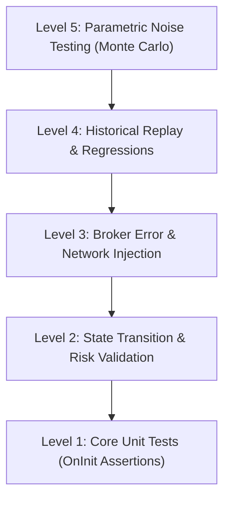

# MNS Trading Engine — Advanced Testing Strategy

**Version:** 2.0  
**Status:** Approved  
**Last Updated:** August 31, 2026

---

## 1. Purpose & Core Philosophy

This document defines the testing methodology, paradigms, and execution frameworks for the **MNS Trading Engine**. 
Because algorithmic trading systems operate in high-risk, real-time environments where logic bugs translate directly to capital losses, MNS enforces a **zero-tolerance testing policy**:
- Every module must be accompanied by an automated test case.
- Interfaces, math correctness, and state transitions must compile with `0 errors, 0 warnings` and pass all assertions before staging.
- Trading systems must remain deterministic: identical market inputs must result in identical trading actions.

---

## 2. The MNS Testing Pyramid

MNS implements a multi-tier testing pipeline to catch bugs at different layers of abstraction:

---

## 3. Core Testing Paradigms

### Tier 1: Unit Testing (Algorithm Isolation)
Ensures that mathematical transformations and indicator scanners inside independent modules are correct and fail-safe.
- **Scope:** Swing detection, structure mapping, liquidity sweep thresholds, POI boundaries.
- **Test Harness:** Evaluated natively in [MNS_TestHarness.mq5](file:///c:/Users/CarixStudio/AppData/Roaming/MetaQuotes/Terminal/D0E8209F77C8CF37AD8BF550E51FF075/MQL5/Experts/MNS_TestHarness/MNS_TestHarness.mq5).
- **Execution:** Runs in `OnInit()`, prints a pass/fail matrix, and returns `INIT_FAILED` to self-remove from the chart.

### Tier 2: State Transition & Active Management Validation
Validates order execution lifecycles, risk constraints, trailing stop tighteners, and emergency exit rules.
- **Scope:** Signal transitions (`NONE` $\rightarrow$ `ACTIVE` $\rightarrow$ `EXECUTED`), 50% partial close sizing, ATR stop buffers, and Friday Flattening.
- **Test Harness:** Evaluated in [MNS_StateTransitionTests.mq5](file:///c:/Users/CarixStudio/AppData/Roaming/MetaQuotes/Terminal/D0E8209F77C8CF37AD8BF550E51FF075/MQL5/Experts/MNS_TestHarness/MNS_StateTransitionTests.mq5).
- **Execution:** Leverages `OverrideState()` and `OverrideDol()` to mock upstream confirmations, isolating the entry and risk engines.

### Tier 3: Fuzz Testing (Chaotic Input Robustness)
Feeds distorted, anomalous, or broken market feeds to the parsing engines to verify stability.
- **Inputs to Inject:**
  - Spreads wider than 100 pips, negative spreads (Ask < Bid).
  - Outlier price gaps (e.g., 500 pip jumps between ticks).
  - Zero-period ATR values (triggering potential divide-by-zero blocks).
  - Sparse historical data (missing candles in arrays).
- **Verification:** The engine must handle the data gracefully, ignoring invalid sweeps or structures without locking up thread execution or throwing array-out-of-range critical exceptions.

### Tier 4: Deterministic Regression Testing (Historical Replay)
Guarantees that changes to core files do not cause drift or unintended shifts in visual marker drawings or trade setups.
- **Framework:** The harness reads historical tick files (saved as raw CSV/binary in `MQL5\Files` from events like Brexit, SNB Peg Removal, or COVID opens) and replays them.
- **Verification:** Resulting `SConfirmationState` structs are hashed and compared to a recorded baseline. Any mismatch blocks merging.

### Tier 5: Broker Interface Error Injection
Simulates poor trade execution and connection drops in real-time execution blocks.
- **Scenarios to Mock:**
  - Requotes (`TRADE_RETCODE_REQUOTE`) during trailing stop movements.
  - Off-quotes (`TRADE_RETCODE_PRICE_OFF`) during emergency drawdown exits.
  - High trade latency (delaying execution by 2–5 seconds).
  - Execution slippage (filling orders at a worse price than requested).
- **Verification:** The Expert Advisor coordinator [MNS_EA.mq5](file:///c:/Users/CarixStudio/AppData/Roaming/MetaQuotes/Terminal/D0E8209F77C8CF37AD8BF550E51FF075/MQL5/Experts/MNS_EA/MNS_EA.mq5) must synchronize its internal state trackers (such as `CRiskEngine` volume state recovery) with the actual account details, refusing to over-allocate risk or send duplicate orders.

### Tier 6: Latency & Performance Micro-benchmarking
Measures computation speeds inside the `OnTick()` handler.
- **Framework:** Wraps calculation blocks in `GetMicrosecondCount()`.
- **Latency Thresholds:**
  - Full tick processing loop must remain **$< 1.0\text{ ms}$** under normal ticks.
  - POI / zone updates must remain **$< 5.0\text{ ms}$** on new candle completions.
- **Reasoning:** In MT5, chart calculations share a single thread. Latency spikes result in execution lag and entry slippage.

---

## 4. Definition of Test Complete (Release Gate)

A release package is approved for live trading only when:
1. [MNS_TestHarness.mq5](file:///c:/Users/CarixStudio/AppData/Roaming/MetaQuotes/Terminal/D0E8209F77C8CF37AD8BF550E51FF075/MQL5/Experts/MNS_TestHarness/MNS_TestHarness.mq5) passes 100% of unit assertions.
2. [MNS_StateTransitionTests.mq5](file:///c:/Users/CarixStudio/AppData/Roaming/MetaQuotes/Terminal/D0E8209F77C8CF37AD8BF550E51FF075/MQL5/Experts/MNS_TestHarness/MNS_StateTransitionTests.mq5) reports `ALL TESTS PASSED` (38/38 assertions).
3. Zero linter or compiler warnings are generated by the MT5 compiler (`metaeditor64.exe`).
4. Latency benchmarks verify tick processing is under the $1.0\text{ ms}$ threshold.
5. Verification runs on multiple timeframes and currency pairs show zero repainting of historical markers.