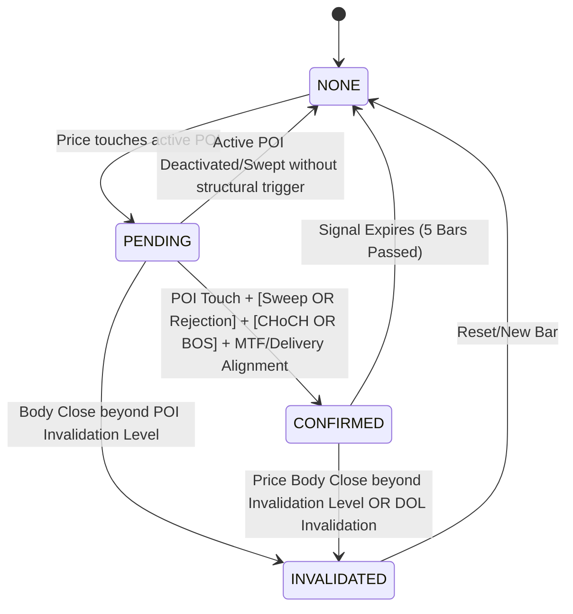

# Module 010 — Confirmation Engine Algorithm

This document defines the step-by-step evaluation pipeline and state transitions executed by `CConfirmationEngine`.

## 1. State Machine Transitions

---

## 2. Invalidation & State Update Pipeline

On each completed bar:

### Step 2.1: Check Active State Invalidation
If the current state is `PENDING` or `CONFIRMED`:
1. **POI Invalidation**: Query `CPOIEngine`. If the associated POI is no longer active or is marked `POI_STATE_INVALIDATED`, invalidate the setup.
2. **Body Close Violation**: Check if `close[1]` closed beyond the invalidation level.
   - For Bullish: `close[1] < invalidationLevel`
   - For Bearish: `close[1] > invalidationLevel`
3. **DOL Target Violation**: Query `CObjectiveEngine`. If the active DOL changes direction or is no longer active, invalidate the setup.
4. **Signal Expiration**: If the current state is `CONFIRMED`, check if `time[1] - triggerTime >= 5 * PeriodSeconds()`. If so, expire the signal and transition back to `NONE`.

If any invalidation triggers, call `Reset()`, set the state to `CONFIRMATION_STATE_INVALIDATED`, and exit.

---

### Step 2.2: Evaluate POI Interaction (NONE -> PENDING)
If the current state is `NONE`:
1. Scan active POIs in `CPOIEngine`.
2. Determine if a POI is touched by the price range at index 1:
   - Bullish POI (Order Block, Breaker, or FVG): `low[1] <= POI.upperPrice` AND `high[1] >= POI.lowerPrice`
   - Bearish POI (Order Block, Breaker, or FVG): `high[1] >= POI.lowerPrice` AND `low[1] <= POI.upperPrice`
3. If touched:
   - Set state to `CONFIRMATION_STATE_PENDING`.
   - Record `m_activePoiId = POI.id`, `m_activePoiType = POI.type`, `m_poiTouchTime = time[1]`.
   - Set `m_poiInvalidationLevel = POI.invalidationLevel`.
   - Exit to wait for confirmations.

---

### Step 2.3: Evaluate Confirmation Checklist (PENDING -> CONFIRMED)
If the current state is `PENDING`:
Verify all mandatory checklist filters:

1. **MTF Agreement**: Query `CStructureEngine`.
   - Bullish setup requires: `structureEngine.GetState().trend != TREND_BEARISH`.
   - Bearish setup requires: `structureEngine.GetState().trend != TREND_BULLISH`.
2. **Delivery Alignment**: Query `CDeliveryStructureEngine`.
   - Bullish setup requires: `deliveryEngine.GetDirection() == DELIVERY_DIR_BULLISH`.
   - Bearish setup requires: `deliveryEngine.GetDirection() == DELIVERY_DIR_BEARISH`.
3. **Liquidity Sweep OR Rejection**:
   - *Liquidity Sweep*: Query `CLiquidityEngine` for swept pools. If a pool of type `LIQUIDITY_SSL` (bullish) or `LIQUIDITY_BSL` (bearish) was swept on or after `m_poiTouchTime`, this is satisfied.
   - *Strong Rejection*: Check the candlestick wick of any bar since `m_poiTouchTime`:
     - Bullish: `(MathMin(open[i], close[i]) - low[i]) >= 0.50 * (high[i] - low[i])` (lower wick size >= 50% of candle range).
     - Bearish: `(high[i] - MathMax(open[i], close[i])) >= 0.50 * (high[i] - low[i])` (upper wick size >= 50% of candle range).
4. **Structural Trigger**: Query `CBreakDetector`. Check if a confirmed break occurred on or after `m_poiTouchTime`:
   - Bullish setup requires: Bullish CHoCH or Bullish BOS.
   - Bearish setup requires: Bearish CHoCH or Bearish BOS.
   - Record the confirming break price and time.
   - Update `invalidationLevel` to the protected swing low (bullish) or swing high (bearish) associated with that break.

If all checklist filters are satisfied:
- Transition state to `CONFIRMATION_STATE_CONFIRMED`.
- Set `triggerPrice = close[1]`, `triggerTime = time[1]`.
- Calculate and set `confidenceScore`.

---

## 3. Confidence Score Calculation

If a setup is confirmed, calculate its score (60 to 100):

| Component | Max Points | Conditions |
|---|---|---|
| **Base Baseline** | 60 | Baseline points awarded for meeting all mandatory confirmation criteria. |
| **POI Confluence** | 10 | +10 if the touched zone is an Order Block and has a confluent FVG zone within it. |
| **Premium / Discount** | 10 | +10 if bullish setup is in a Discount zone (price < 50% of the active delivery range) or bearish setup is in a Premium zone. |
| **Session Alignment** | 10 | +10 if trigger time falls within Tokyo (00-08), London (08-16), or NY (13-21) session hours. |
| **Displacement Conviction** | 10 | +10 if the confirming break candle body is >= 2.0 * ATR. |
