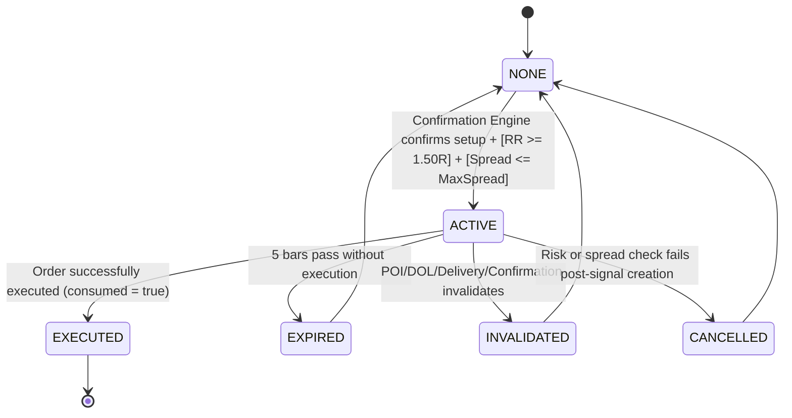

# Module 011 — Entry Engine Algorithm

This document defines the step-by-step evaluation pipeline and state transitions executed by `CEntryEngine`.

## 1. State Machine Transitions

---

## 2. Signal Evaluation & Tracking Pipeline

On each completed bar:

### Step 2.1: Track and Update Existing Active Signals
If an active signal is currently recorded (`m_activeSignal.state == ENTRY_STATE_ACTIVE`):
1. **Confirmation State Invalidation**: Query `CConfirmationEngine`. If its state is no longer `CONFIRMATION_STATE_CONFIRMED` (e.g. it transitioned to `INVALIDATED` or `NONE`), transition the signal to `ENTRY_STATE_INVALIDATED`.
2. **POI Invalidation**: Query `CPOIEngine` for the POI with ID `m_activeSignal.associatedPoiId`. If it is no longer active or is marked `POI_STATE_INVALIDATED`, transition the signal to `ENTRY_STATE_INVALIDATED`.
3. **DOL Target Invalidation**: Query `CObjectiveEngine`. If the active DOL changes direction or shifts such that the target price would result in a Risk-to-Reward ratio `< 1.50R`, transition the signal to `ENTRY_STATE_INVALIDATED`.
4. **Delivery Invalidation**: Query `CDeliveryStructureEngine`. If the active delivery leg is invalidated (`lifecycle == DELIVERY_INVALIDATED`), transition the signal to `ENTRY_STATE_INVALIDATED`.
5. **Signal Expiration**: Check if the current bar time `time[1]` has exceeded the expiration time:
   - `barsPassed = (time[1] - m_activeSignal.triggerTime) / PeriodSeconds()`
   - If `barsPassed >= 5`, set state to `ENTRY_STATE_EXPIRED`.
6. **Spread Check**: If the spread on the current tick exceeds `maxSpreadAllowed`, set state to `ENTRY_STATE_CANCELLED`.
7. **Risk-Reward (RR) Validation**: Re-calculate RR:
   - `RiskDistance = abs(m_activeSignal.entryPrice - m_activeSignal.stopLoss)`
   - `RewardDistance = abs(m_activeSignal.takeProfit - m_activeSignal.entryPrice)`
   - If `RiskDistance == 0` or `RewardDistance / RiskDistance < 1.50`, transition the signal to `ENTRY_STATE_CANCELLED`.

If any of the invalidation/cancellation rules are met:
- Update the signal state.
- Log the reason using `CLogger` from the Shared Infrastructure.
- Reset the active signal tracking when returning back to `NONE`.

---

### Step 2.2: Detect New Entry Signals (NONE -> ACTIVE)
If no active signal exists:
1. **Query Confirmation Engine**: Check if `CConfirmationEngine` reports `GetConfirmationState() == CONFIRMATION_STATE_CONFIRMED`.
2. **Duplicate Prevention check**:
   - Verify if this confirmation's `triggerTime` has already been executed/consumed by checking the historical logs or `m_consumedSignals` registry.
   - If `triggerTime` matches any previously consumed signal time, skip to prevent double execution.
3. **Calculate Risk-Reward (RR)**:
   - Get `triggerPrice` and `invalidationLevel` from `CConfirmationEngine`.
   - Get active DOL price from `CObjectiveEngine` as target.
   - `RiskDistance = abs(triggerPrice - invalidationLevel)`.
   - `RewardDistance = abs(dolPrice - triggerPrice)`.
   - If `RiskDistance == 0` or `RewardDistance / RiskDistance < 1.50`, reject signal (log as "RR filter failed").
4. **Filter Spread**:
   - Verify `currentSpread <= maxSpreadAllowed`. If exceeded, reject signal (log as "Spread filter failed").
5. **Generate Signal**:
   - Set signal `state = ENTRY_STATE_ACTIVE`.
   - Set `direction = CONFIRMATION_DIR_BULLISH` or `CONFIRMATION_DIR_BEARISH`.
   - Set `entryPrice = triggerPrice`, `stopLoss = invalidationLevel`, `takeProfit = dolPrice`.
   - Set `triggerTime = triggerTime`, `expirationTime = triggerTime + 5 * PeriodSeconds()`.
   - Set `confidenceScore = confidenceScore`.
   - Set `consumed = false`.

---

### Step 2.3: Consume Signal (ACTIVE -> EXECUTED)
When the EA Integration (Module 014) executes a trade based on the active signal:
1. Mark the signal as `consumed = true`.
2. Transition the signal state to `ENTRY_STATE_EXECUTED`.
3. Save the `triggerTime` of this signal into the historical `m_consumedSignals` array to ensure duplicate execution cannot occur even if the engine restarts.
