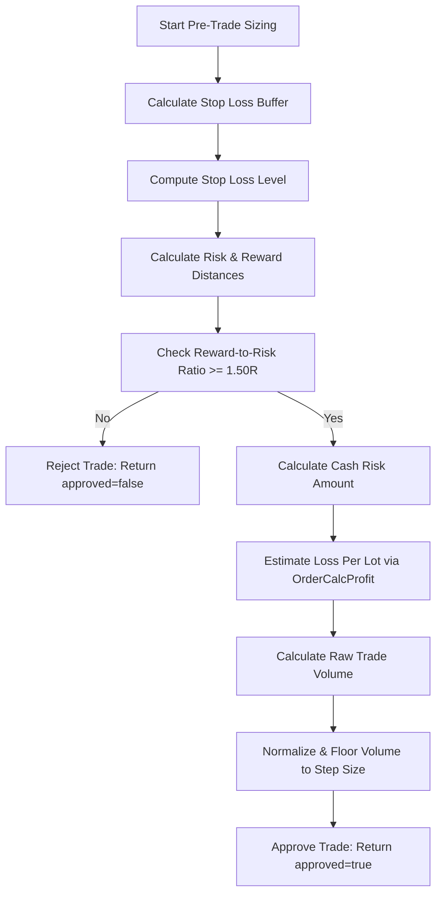
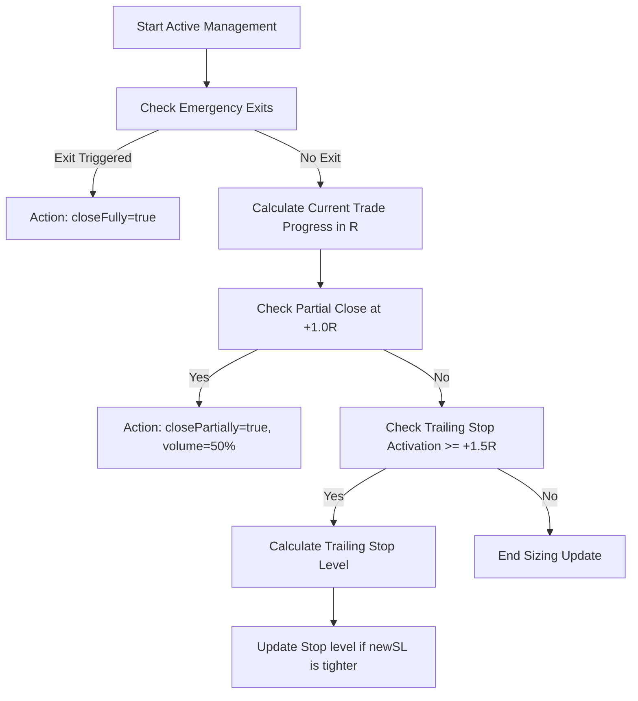

# Module 012 — Risk Engine Algorithm

This document outlines the step-by-step processing algorithm for **Module 012: Risk Engine**.

## 1. Pre-Trade Risk Sizing Pipeline

When a trade signal is passed from the Entry Engine to the Risk Engine, the sizing pipeline executes the following checks in sequence:

### Step 1: Calculate Stop Loss Buffer
1. Compute ATR-based offset:
   $$\text{AtrOffset} = 0.20 \times \text{atr14}$$
2. Compute point-based minimum offset:
   $$\text{MinOffset} = 2.0 \times \text{SYMBOL\_POINT}$$
3. Take the maximum:
   $$\text{StopBuffer} = \max(\text{AtrOffset}, \text{MinOffset})$$

### Step 2: Compute Stop Loss Level
1. If trade direction is Bullish:
   $$\text{SL} = \text{invalidationLevel} - \text{StopBuffer}$$
2. If trade direction is Bearish:
   $$\text{SL} = \text{invalidationLevel} + \text{StopBuffer}$$

### Step 3: Compute Risk and Reward Distances
1. Compute distance to stop loss:
   $$\text{RiskDistance} = \text{EntryPrice} - \text{SL}$$
2. If $\text{RiskDistance} \le 0.0$ (or invalid pricing parameters), reject immediately.
3. Compute distance to take profit:
   $$\text{RewardDistance} = \text{TakeProfit} - \text{EntryPrice}$$
4. If $\text{RewardDistance} \le 0.0$, reject immediately.

### Step 4: Verify Reward-to-Risk Ratio
1. Compute ratio:
   $$\text{RR} = \frac{\text{RewardDistance}}{\text{RiskDistance}}$$
2. If $\text{RR} < 1.50$, set `approved = false` and return.

### Step 5: Compute Cash Risk Amount
1. Clamp risk percentage between `0.25%` and `2.00%`:
   $$\text{RiskPercent} = \max(0.25, \min(2.00, \text{riskPercent}))$$
2. Calculate cash risk:
   $$\text{RiskAmount} = \text{accountEquity} \times \frac{\text{RiskPercent}}{100.0}$$

### Step 6: Compute Position Size (Volume)
1. Query MT5's `OrderCalcProfit()` (or use tick value fallback if offline) to determine the loss in deposit currency for a 1.0 lot trade:
   - For Buy: `action = ORDER_TYPE_BUY`, `open_price = EntryPrice`, `close_price = SL`, `volume = 1.0`.
   - For Sell: `action = ORDER_TYPE_SELL`, `open_price = EntryPrice`, `close_price = SL`, `volume = 1.0`.
   - Let the output profit value be `profitVal`.
   - If call fails, fallback to:
     $$\text{LossPerLot} = \frac{\text{RiskDistance}}{\text{SYMBOL\_POINT}} \times \text{SYMBOL\_TRADE\_TICK\_VALUE} \times \frac{1.0}{\text{SYMBOL\_TRADE\_TICK\_SIZE}}$$
   - Otherwise:
     $$\text{LossPerLot} = |\text{profitVal}|$$
2. Compute raw volume:
   $$\text{RawVolume} = \frac{\text{RiskAmount}}{\text{LossPerLot}}$$
3. Normalize to symbol limits:
   - Retrieve `SYMBOL_VOLUME_MIN`, `SYMBOL_VOLUME_MAX`, and `SYMBOL_VOLUME_STEP`.
   - Align volume to step size:
     $$\text{Steps} = \text{floor}\left(\frac{\text{RawVolume}}{\text{SYMBOL\_VOLUME\_STEP}}\right)$$
     $$\text{Volume} = \text{Steps} \times \text{SYMBOL\_VOLUME\_STEP}$$
   - Bounded limits:
     $$\text{Volume} = \max(\text{SYMBOL\_VOLUME\_MIN}, \min(\text{SYMBOL\_VOLUME\_MAX}, \text{Volume}))$$
4. Double check risk tolerance:
   - If $\text{Volume} \times \text{LossPerLot} > \text{RiskAmount}$, reduce by 1 step (to ensure we never round up and exceed risk).
5. If $\text{Volume} \le 0.0$, reject.
6. Set `approved = true` and populate outputs.

---

## 2. Active Trade Management Pipeline

Monitors open trades on each bar or tick to manage exits, partial closes, and trailing stops:

### Step 1: Check Emergency Exits
1. Trigger full close (`closeFully = true`) if any of the following conditions is met:
   - `isDolReached == true` (Trade hit the liquidity target).
   - `isDolInvalidated == true` (Target shifted away or became invalid).
   - `deliveryLifecycle == DELIVERY_INVALIDATED` (Delivery leg broken by body close).
   - `mtfReversal == true` (MTF alignment bias reversed).
   - `dailyDrawdownPercent >= maxDailyDrawdownLimit` (Account daily protection breached).

### Step 2: Calculate Trade Progress
1. Let position entry price be $\text{EntryPrice}$ and current market price be $\text{Price}$ ($\text{Bid}$ for Buy, $\text{Ask}$ for Sell).
2. Calculate original risk distance:
   $$\text{RiskDistance} = |\text{EntryPrice} - \text{positionOriginalSL}|$$
3. If $\text{RiskDistance} \le 0.0$, return.
4. Calculate current trade progress:
   - Buy: $\text{ProgressPrice} = \text{Bid} - \text{EntryPrice}$
   - Sell: $\text{ProgressPrice} = \text{EntryPrice} - \text{Ask}$
5. Compute progress in units of R:
   $$\text{ProgressR} = \frac{\text{ProgressPrice}}{\text{RiskDistance}}$$

### Step 3: Evaluate Partial Close
1. If $\text{ProgressR} \ge 1.0$ and `hasPartialClosed == false`:
   - Set `closePartially = true`.
   - Set `partialVolume = positionCurrentVolume * 0.50` (normalize to volume step).
   - Mark `hasPartialClosed = true` to prevent repeat triggers.

### Step 4: Evaluate Trailing Stop
1. If $\text{ProgressR} \ge 1.50$:
   - Calculate current trailing stop candidate price:
     - Buy: $\text{TrailingSL} = \text{Bid} - \text{atr14}$
     - Sell: $\text{TrailingSL} = \text{Ask} + \text{atr14}$
   - Adjust trailing stop trigger frequency:
     - Determine the multiplier tier:
       $$\text{Tier} = \text{floor}\left(\frac{\text{ProgressR} - 1.50}{0.50}\right)$$
     - If `currentTier > lastUpdatedTier`:
       - If $\text{TrailingSL}$ is better than current stop level (tighter):
         - Set `newStopLoss = TrailingSL`.
         - Update `lastUpdatedTier = currentTier`.
