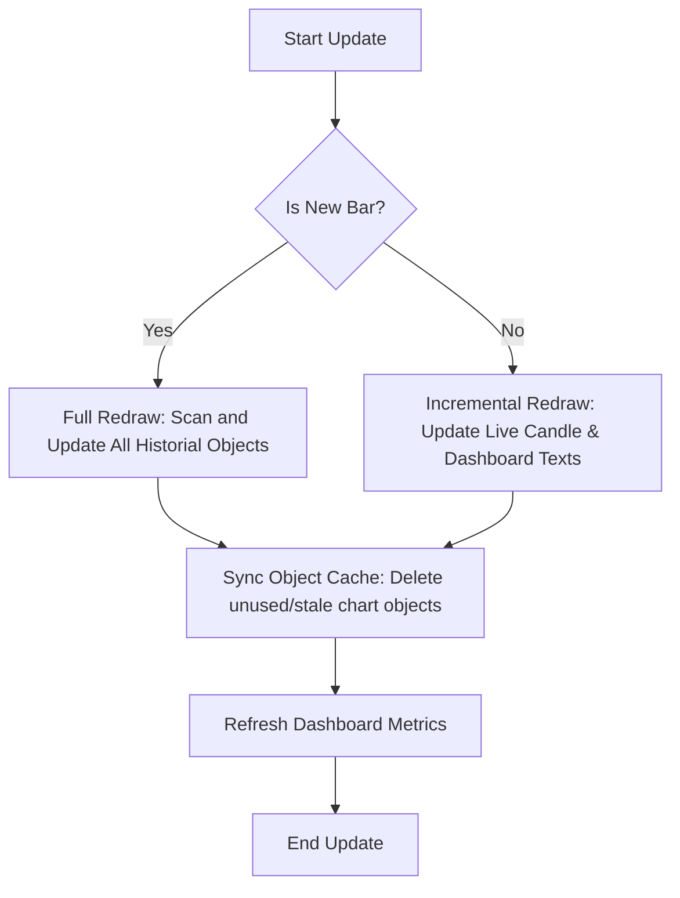

# Module 013 — Indicator Integration Algorithm

This document outlines the step-by-step processing pipeline and rendering algorithms for **Module 013: Indicator Integration**.

## 1. Rendering Pipeline

The module executes the rendering pipeline in the following sequence during each update call:

### Step 1: Detect New Bar
1. Check if the current open time of bar 0 has changed since the last update.
2. If yes, set the `isNewBar` flag to true to trigger historical object refreshes.

### Step 2: Sync Object Cache & Draw Chart Objects
To prevent redrawing lag:
1. **Name Prefixing**: Every object created by the MNS Indicator must be prefixed with `MNS_` (e.g., `MNS_BOS_1710500`, `MNS_OB_45`). This allows clean identification and bulk deletion on deinitialization.
2. **Object Tracking**: Keep a list of currently active object names in memory.
3. **Lazy Draw Swings**:
   - Loop through the swing detector's confirmed swings.
   - For each swing:
     - Construct name: `MNS_SWING_` + `time`.
     - Check if object exists. If not, create an arrow object (`OBJ_ARROW`):
       - Bullish: Arrow Code 234 (arrow up) placed at `swing.price - buffer`.
       - Bearish: Arrow Code 233 (arrow down) placed at `swing.price + buffer`.
4. **Lazy Draw Structure Breaks**:
   - Loop through the break detector's confirmed breaks.
   - Construct name: `MNS_BREAK_` + `time`.
   - Create a horizontal line segment (`OBJ_TREND`):
     - Start time = `break.time`, start price = `break.price`.
     - End time = `currentTime`, end price = `break.price`.
     - Color: Green for Bullish BOS, Red for Bearish BOS, Orange for CHoCH.
5. **Lazy Draw POIs (Order Blocks & FVGs)**:
   - Loop through active POIs in the POI engine.
   - Construct name: `MNS_POI_` + `poi.id`.
   - Create a rectangle object (`OBJ_RECTANGLE`):
     - Coordinates: (time1 = `poi.startTime`, price1 = `poi.upper`), (time2 = `poi.endTime` or `currentTime` if active, price2 = `poi.lower`).
     - Set background transparency on the rectangle to keep the chart legible.

### Step 3: Draw/Refresh Dashboard Label Panel
The dashboard panel is constructed once on initialization and only its content strings are modified on ticks.
1. **Background Panel**:
   - Create `OBJ_RECTANGLE_LABEL` anchored to the top-right.
   - Set background color (Dark Gray, default RGB 25, 25, 25).
   - Set border width to 1 and size to 250px width.
2. **Text Fields**:
   - Create multiple text label objects (`OBJ_LABEL`) anchored inside the background panel coordinates.
   - Text fields are stacked vertically (e.g. 15px line spacing).
   - Update text descriptions:
     - **Trend Line**: `Trend: [BULLISH / BEARISH / RANGING]` colored accordingly.
     - **Phase Line**: `Phase: [TRENDING / PULLBACK / RANGE]`.
     - **Active POI Line**: `POI: [OB / FVG / NONE]`.
     - **Session Line**: `Session: [LONDON / NEW YORK / ASIA / OVERLAP]`.
     - **Pre-trade Line**: `Entry: [Price] | Vol: [Lots] | RR: [Value]`.

### Step 4: Object Garbage Collection
1. On each new bar update, scan the chart for all objects prefixed with `MNS_`.
2. Compare the active objects on the chart with the list of active engine states.
3. If an object on the chart is no longer associated with any active swing, break, POI, or setup state in the engine:
   - Delete it from the chart to prevent clutter.
