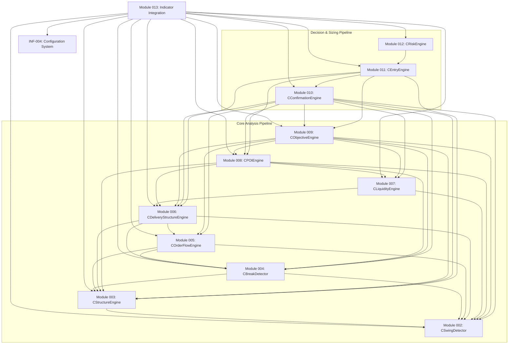

# Module 013 — Stage 0: Architecture, Dependency & Configuration Audit
**MNS Trading Engine — Indicator Integration**

This document presents the complete architectural, dependency, and configuration audit performed for **Module 013 — Indicator Integration** within the MNS Trading Engine repository.

---

## A. Files Inspected

The following files have been audited to determine integration pathways, dependencies, and configuration parameters:

### 1. Documentation Files
- [docs/modules/013_ALGORITHM.md](file:///c:/Users/CarixStudio/AppData/Roaming/MetaQuotes/Terminal/D0E8209F77C8CF37AD8BF550E51FF075/MQL5/mns-engine/docs/modules/013_ALGORITHM.md) — Module 013 Algorithm Specs
- [docs/modules/013_IndicatorIntegration.md](file:///c:/Users/CarixStudio/AppData/Roaming/MetaQuotes/Terminal/D0E8209F77C8CF37AD8BF550E51FF075/MQL5/mns-engine/docs/modules/013_IndicatorIntegration.md) — Core Architecture
- [docs/modules/013-Indicator.md](file:///c:/Users/CarixStudio/AppData/Roaming/MetaQuotes/Terminal/D0E8209F77C8CF37AD8BF550E51FF075/MQL5/mns-engine/docs/modules/013-Indicator.md) — Outline Specification
- [docs/indicator/UI_UX_SPECIFICATION.md](file:///c:/Users/CarixStudio/AppData/Roaming/MetaQuotes/Terminal/D0E8209F77C8CF37AD8BF550E51FF075/MQL5/mns-engine/docs/indicator/UI_UX_SPECIFICATION.md) — Visual Design
- [docs/INDICATOR_SPECIFICATION.md](file:///c:/Users/CarixStudio/AppData/Roaming/MetaQuotes/Terminal/D0E8209F77C8CF37AD8BF550E51FF075/MQL5/mns-engine/docs/INDICATOR_SPECIFICATION.md) — Functional Specification
- [docs/Architecture.md](file:///c:/Users/CarixStudio/AppData/Roaming/MetaQuotes/Terminal/D0E8209F77C8CF37AD8BF550E51FF075/MQL5/mns-engine/docs/Architecture.md) — High-Level Design Principles
- [docs/ENGINE_ARCHITECTURE_V2.md](file:///c:/Users/CarixStudio/AppData/Roaming/MetaQuotes/Terminal/D0E8209F77C8CF37AD8BF550E51FF075/MQL5/mns-engine/docs/ENGINE_ARCHITECTURE_V2.md) — V2 Architecture Overview
- [docs/TechnicalDesign.md](file:///c:/Users/CarixStudio/AppData/Roaming/MetaQuotes/Terminal/D0E8209F77C8CF37AD8BF550E51FF075/MQL5/mns-engine/docs/TechnicalDesign.md) — Technical Layout
- [docs/CLASS_DIAGRAM.md](file:///c:/Users/CarixStudio/AppData/Roaming/MetaQuotes/Terminal/D0E8209F77C8CF37AD8BF550E51FF075/MQL5/mns-engine/docs/CLASS_DIAGRAM.md) — Diagram Blueprint
- [docs/TODO_STRATEGY.md](file:///c:/Users/CarixStudio/AppData/Roaming/MetaQuotes/Terminal/D0E8209F77C8CF37AD8BF550E51FF075/MQL5/mns-engine/docs/TODO_STRATEGY.md) — Ambiguity Resolution Log
- [docs/infrastructure/specs/INF_004_Configuration.md](file:///c:/Users/CarixStudio/AppData/Roaming/MetaQuotes/Terminal/D0E8209F77C8CF37AD8BF550E51FF075/MQL5/mns-engine/docs/infrastructure/specs/INF_004_Configuration.md) — Configuration Specification

### 2. Core MQL5 Headers & Implementations
- [Include/MNS/MNSCore.mqh](file:///c:/Users/CarixStudio/AppData/Roaming/MetaQuotes/Terminal/D0E8209F77C8CF37AD8BF550E51FF075/MQL5/mns-engine/Include/MNS/MNSCore.mqh) — INF-000 Global constants & Assertions
- [Include/MNS/MNSTypes.mqh](file:///c:/Users/CarixStudio/AppData/Roaming/MetaQuotes/Terminal/D0E8209F77C8CF37AD8BF550E51FF075/MQL5/mns-engine/Include/MNS/MNSTypes.mqh) — Module 001 Shared Enums & Structs
- [Include/MNS/MNSConfig.mqh](file:///c:/Users/CarixStudio/AppData/Roaming/MetaQuotes/Terminal/D0E8209F77C8CF37AD8BF550E51FF075/MQL5/mns-engine/Include/MNS/MNSConfig.mqh) — INF-004 Configuration Engine
- [Include/MNS/MNSUtils.mqh](file:///c:/Users/CarixStudio/AppData/Roaming/MetaQuotes/Terminal/D0E8209F77C8CF37AD8BF550E51FF075/MQL5/mns-engine/Include/MNS/MNSUtils.mqh) — INF-002 Array & Time Utilities
- [Include/MNS/MNSVolatility.mqh](file:///c:/Users/CarixStudio/AppData/Roaming/MetaQuotes/Terminal/D0E8209F77C8CF37AD8BF550E51FF075/MQL5/mns-engine/Include/MNS/MNSVolatility.mqh) — INF-003 ATR calculations
- [Include/MNS/CSwingDetector.mqh](file:///c:/Users/CarixStudio/AppData/Roaming/MetaQuotes/Terminal/D0E8209F77C8CF37AD8BF550E51FF075/MQL5/mns-engine/Include/MNS/CSwingDetector.mqh) — Module 002 Swing Detection
- [Include/MNS/CStructureEngine.mqh](file:///c:/Users/CarixStudio/AppData/Roaming/MetaQuotes/Terminal/D0E8209F77C8CF37AD8BF550E51FF075/MQL5/mns-engine/Include/MNS/CStructureEngine.mqh) — Module 003 Market Structure
- [Include/MNS/CBreakDetector.mqh](file:///c:/Users/CarixStudio/AppData/Roaming/MetaQuotes/Terminal/D0E8209F77C8CF37AD8BF550E51FF075/MQL5/mns-engine/Include/MNS/CBreakDetector.mqh) — Module 004 BOS/CHoCH Detection
- [Include/MNS/COrderFlowEngine.mqh](file:///c:/Users/CarixStudio/AppData/Roaming/MetaQuotes/Terminal/D0E8209F77C8CF37AD8BF550E51FF075/MQL5/mns-engine/Include/MNS/COrderFlowEngine.mqh) — Module 005 Order Flow Transitions
- [Include/MNS/CDeliveryStructureEngine.mqh](file:///c:/Users/CarixStudio/AppData/Roaming/MetaQuotes/Terminal/D0E8209F77C8CF37AD8BF550E51FF075/MQL5/mns-engine/Include/MNS/CDeliveryStructureEngine.mqh) — Module 006 Delivery Legs
- [Include/MNS/CLiquidityEngine.mqh](file:///c:/Users/CarixStudio/AppData/Roaming/MetaQuotes/Terminal/D0E8209F77C8CF37AD8BF550E51FF075/MQL5/mns-engine/Include/MNS/CLiquidityEngine.mqh) — Module 007 Liquidity Levels
- [Include/MNS/CPOIEngine.mqh](file:///c:/Users/CarixStudio/AppData/Roaming/MetaQuotes/Terminal/D0E8209F77C8CF37AD8BF550E51FF075/MQL5/mns-engine/Include/MNS/CPOIEngine.mqh) — Module 008 Order Blocks & FVGs
- [Include/MNS/CObjectiveEngine.mqh](file:///c:/Users/CarixStudio/AppData/Roaming/MetaQuotes/Terminal/D0E8209F77C8CF37AD8BF550E51FF075/MQL5/mns-engine/Include/MNS/CObjectiveEngine.mqh) — Module 009 Objectives & DOL
- [Include/MNS/CConfirmationEngine.mqh](file:///c:/Users/CarixStudio/AppData/Roaming/MetaQuotes/Terminal/D0E8209F77C8CF37AD8BF550E51FF075/MQL5/mns-engine/Include/MNS/CConfirmationEngine.mqh) — Module 010 Confirmation Checklist
- [Include/MNS/CEntryEngine.mqh](file:///c:/Users/CarixStudio/AppData/Roaming/MetaQuotes/Terminal/D0E8209F77C8CF37AD8BF550E51FF075/MQL5/mns-engine/Include/MNS/CEntryEngine.mqh) — Module 011 Entry Signal Filters
- [Include/MNS/CRiskEngine.mqh](file:///c:/Users/CarixStudio/AppData/Roaming/MetaQuotes/Terminal/D0E8209F77C8CF37AD8BF550E51FF075/MQL5/mns-engine/Include/MNS/CRiskEngine.mqh) — Module 012 Position Sizing & Trailing

### 3. Verification Files
- [Experts/MNS_TestHarness/MNS_TestHarness.mq5](file:///c:/Users/CarixStudio/AppData/Roaming/MetaQuotes/Terminal/D0E8209F77C8CF37AD8BF550E51FF075/MQL5/mns-engine/Experts/MNS_TestHarness/MNS_TestHarness.mq5) — Verification Test Suite

---

## B. Existing Module 013 Architecture

Module 013 (`CIndicatorIntegration`) is the **Presentation, Observation, and Configuration Layer** of the MNS Trading Engine. It functions strictly as a stateless visual mapper: it queries computed states from the backend analysis engines (Modules 002–012) and draws corresponding graphics onto the MT5 chart. It contains zero trading or analytical logic.

The module is decomposed into four architectural pillars:
1. **Indicator Entry & Engine Lifecycle (`CIndicatorIntegration`)**: Initializes configurations (`CMNSConfig`), loads active values, runs the engine update loop, and manages coordinate offsets.
2. **Object Manager**: Owns visual objects created by the indicator. It utilizes a caching pattern to reuse existing chart elements, updating their positions/properties dynamically rather than deleting and recreating them on every tick (eliminating flicker).
3. **Visual Rendering Engine**: Dispatches drawing updates to specific renderers:
   - **Swing Renderer**: Draws swing pivot points (`OBJ_ARROW` or `OBJ_TEXT`).
   - **Structure Break Renderer**: Draws lines indicating BOS (`OBJ_TREND` in green/red) and CHoCH (`OBJ_TREND` in orange).
   - **Liquidity Renderer**: Draws horizontal dashed lines (`OBJ_TREND` or `OBJ_HLINE`) indicating BSL/SSL pools.
   - **POI Renderer**: Draws transparent rectangles (`OBJ_RECTANGLE`) representing OBs and FVGs.
   - **Zone Renderer**: Draws dealing range premium/discount regions and equilibrium levels.
4. **Dashboard Renderer**: Pins a dark-gray semi-transparent label panel (`OBJ_RECTANGLE_LABEL` and `OBJ_LABEL`) on the top-right of the chart displaying market bias, structural phase, active POIs, sessions, risk factors, and engine states.

---

## C. Dependency Graph

The visual rendering engine relies directly on the configuration system and the core engines. The analysis engines form a sequential data pipeline where each module feeds into the next.



---

## D. Required Engine APIs

Module 013 queries the following public interfaces to extract visual data:

| Module / Class | Data Needed | Method / API | Return Type | Data Frequency & Mutability |
| :--- | :--- | :--- | :--- | :--- |
| **CSwingDetector** | Swing points history | `GetExternalSwingCount()`, `GetExternalSwing(index)`<br>`GetInternalSwingCount()`, `GetInternalSwing(index)` | `int`<br>`SSwingPoint` | Historical, Immutable once confirmed |
| **CStructureEngine** | Market trend & phase | `GetState()` | `SMarketState` | Current-state, Mutable per new swing |
| **CBreakDetector** | Structure breaks (BOS/CHoCH) | `GetBreakCount()`, `GetBreak(index)` | `int`<br>`SStructureBreak` | Historical, Immutable once candle closes |
| **COrderFlowEngine** | Order flow direction | `GetState()`, `GetDirection()` | `SOrderFlowState`, `EOrderFlowDirection` | Current-state, Mutable |
| **CDeliveryStructureEngine** | Active price-delivery leg | `GetState()` | `SDeliveryState` | Current-state, Mutable |
| **CLiquidityEngine** | Tracked BSL/SSL pools | `GetPoolsCount()`, `GetPool(index, pool)` | `int`, `bool` (via reference) | Mixed (128 pools in history), Mutable states |
| **CPOIEngine** | Order Blocks, FVGs, equilibrium | `GetPoIsCount()`, `GetPoI(index, poi)` | `int`, `bool` (via reference) | Mixed (128 POIs in history), Mutable states |
| **CObjectiveEngine** | Active target (DOL) | `GetActiveDol()`, `GetDolPrice()` | `SDolDefinition`, `double` | Current-state, Dynamic |
| **CConfirmationEngine** | Active confirmation status | `GetState()`, `GetConfirmationState()` | `SConfirmationState`, `EConfirmationState` | Current-state, Dynamic |
| **CEntryEngine** | Active trade setup signal | `GetActiveSignal()` | `SEntrySignal` | Current-state, Transient |
| **CRiskEngine** | Lot sizing & expected RR | `SizePreTrade()` | `SRiskSizingResult` | Query-only recalculation |

---

## E. Missing APIs

The audit identified several areas where the indicator needs information that the existing modules do not expose. These must be addressed prior to implementing visual elements:

> [!WARNING]
> The existing CDeliveryStructureEngine, CObjectiveEngine, CConfirmationEngine, and CEntryEngine classes only store the **single current active state** in memory. Storing history is omitted in the analysis layer.

1. **MISSING API: Historical Delivery Legs (`CDeliveryStructureEngine`)**
   - *Why Required:* Displaying "Completed", "Replaced", "Archived", and "Mitigated" delivery legs on the chart requires querying past delivery legs. The engine currently only retains `m_state`.
   - *Proposed Workaround:* Visualizer must maintain an internal transient cache of past delivery legs, or `CDeliveryStructureEngine` must be updated with an array of past delivery structures.
2. **MISSING API: Historical active DOLs / Targets (`CObjectiveEngine`)**
   - *Why Required:* Drawing historical lines where previous objectives were hit or invalidated.
   - *Proposed Workaround:* Inferred from the visual cache of chart objects or by adding a history buffer inside the objective engine.
3. **MISSING API: Classified Swing Strength / Strong-Weak Swings**
   - *Why Required:* Rendering "Strong High", "Strong Low", "Weak High", "Weak Low" text tags above/below swings.
   - *Proposed Workaround:* Since `SSwingPoint` has no strength classification field, the renderer must infer this using the active trend: Bullish trend means swing low is Strong (protected) and swing high is Weak (target); Bearish trend means swing high is Strong (protected) and swing low is Weak (target).
4. **MISSING API: Risk Engine parameters in `MNSConfig`**
   - *Why Required:* Lot sizing (`volume`) and risk amount calculations on the dashboard. `CRiskEngine::SizePreTrade` requires parameters like default risk percent, max risk percent, etc., which are currently passed to `CRiskEngine::Initialize` but are missing from `SEngineConfig` and `CMNSConfig.mqh`.
5. **MISSING API: Session Engine or Current Active Session State**
   - *Why Required:* Showing `Session: [LONDON / NEW YORK / ASIA / OVERLAP]` on the dashboard.
   - *Proposed Workaround:* Use `CMNSUtils::IsInSession()` statically inside the indicator integration controller to determine session state dynamically on every tick.

---

## F. Visual Output Inventory

Every visual item that the indicator will display is mapped below:

| Visual Item | Source Module | Source API | Visual Type | Update Frequency | Lifetime | Can Repaint? | Can be Hidden? | Depends on Config? |
| :--- | :--- | :--- | :--- | :--- | :--- | :--- | :--- | :--- |
| **Swing High / Low** | SwingDetector | `GetExternalSwing()`, `GetInternalSwing()` | `OBJ_ARROW` (Arrow 233/234) | New Bar | Persistent | No | Yes | `ShowSwings` |
| **Strong/Weak High/Low** | StructureEngine | `GetState().trend` (Inferred) | `OBJ_TEXT` label above/below swing | New Bar | Persistent | No | Yes | `ShowSwings` |
| **BOS / iBOS** | BreakDetector | `GetBreak()` | `OBJ_TREND` (Solid line green/red) | New Bar | Persistent | No | Yes | `ShowBOS` |
| **CHoCH** | BreakDetector | `GetBreak()` | `OBJ_TREND` (Solid line orange) | New Bar | Persistent | No | Yes | `ShowCHoCH` |
| **Order Flow Bias** | OrderFlowEngine| `GetState().direction` | Dashboard status string | Tick | Transient | Yes | Yes | `ShowDashboard` |
| **Active Delivery Leg**| DeliveryEngine | `GetState()` | `OBJ_TREND` (Thick ray arrow) | Tick | Transient | Yes | Yes | `ShowDelivery` |
| **BSL / SSL Pools** | LiquidityEngine| `GetPool()` | `OBJ_TREND` (Dashed line) | Tick (Sweeps) | Mixed | No (Wicks sweep) | Yes | `ShowLiquidity` |
| **Equal Highs/Lows** | LiquidityEngine| `GetPool()` (source=LIQ_SRC_EQ) | `OBJ_TREND` (Double dashed lines) | Tick (Sweeps) | Mixed | No | Yes | `ShowLiquidity` |
| **PDH/PDL & PWH/PWL** | LiquidityEngine| `GetPool()` (Daily/Weekly source) | `OBJ_TREND` (Colored lines with text) | Tick (Sweeps) | Mixed | No | Yes | `ShowLiquidity` |
| **Order Block (OB)** | POIEngine | `GetPoI()` (type=OB) | `OBJ_RECTANGLE` (Solid fill 85% opacity) | Tick (Mitigation) | Mixed | No (Fades on mit) | Yes | `ShowOrderBlocks`|
| **Fair Value Gaps (FVG)**| POIEngine | `GetPoI()` (type=FVG) | `OBJ_RECTANGLE` (Hatched fill) | Tick (Fills) | Mixed | Yes (Fills update) | Yes | `ShowFVG` |
| **Premium/Discount** | POIEngine | `GetEquilibrium()`, `GetDealingRangeZone()`| `OBJ_TREND` (Mid line + zones) | New Bar | Transient | Yes | Yes | `ShowPremiumDisc`|
| **Objective Target (DOL)**| ObjectiveEngine| `GetActiveDol()` | `OBJ_TREND` (Target level ray) | Tick (Touches) | Transient | Yes | Yes | `ShowObjective` |
| **Confirmation Status**| ConfirmEngine  | `GetConfirmationState()` | Dashboard checklist | Tick | Transient | Yes | Yes | `ShowDashboard` |
| **Entry Readiness** | EntryEngine | `GetActiveSignal()` | Dashboard + optional `OBJ_TREND` zone| Tick | Transient | Yes | Yes | `ShowDashboard` |
| **Risk / Lot Sizing** | RiskEngine | `SizePreTrade()` | Dashboard status text | Tick | Transient | Yes | Yes | `ShowDashboard` |
| **Dashboard Panel** | Core Controller| standard MT5 APIs | `OBJ_RECTANGLE_LABEL` + `OBJ_LABEL` | Tick (Live text) | Permanent | Yes | Yes | `ShowDashboard` |

---

## G. Configuration Exposure Matrix

The following parameters are audited from `Include/MNS/MNSConfig.mqh` and UI layout specs, classifying their impact and behavior:

| Parameter | Location | Default Value | MQL5 Type | Module | Purpose | Strategy-Critical? | User Config? | Dashboard Editable? | Allowed Range | Re-calc Engine? | Redraw Chart? |
| :--- | :--- | :--- | :--- | :--- | :--- | :--- | :--- | :--- | :--- | :--- | :--- |
| **externalDepth** | MNSConfig | 15 | `int` | Structure | Swing confirmation lookback | Yes | Yes | Possibly | `[5..50]` | Yes | Yes |
| **internalDepth** | MNSConfig | 5 | `int` | Structure | Swing confirmation lookback | Yes | Yes | Possibly | `[1..15]` | Yes | Yes |
| **atrTolerance** | MNSConfig | 0.0010 | `double` | Structure | Equal pivot ATR multiplier | Yes | Yes | No | `[0.0..0.05]` | Yes | Yes |
| **minBreakDistance** | MNSConfig | 0.0000 | `double` | Structure | Break confirmation buffer | Yes | Yes | No | `[0.0..0.01]` | Yes | Yes |
| **confidenceThreshold** | MNSConfig | 94.0 | `double` | Structure | Min engine confidence required | Yes | Yes | Possibly | `[50..100]` | Yes | Yes |
| **displacementMinAtrMultiple** | MNSConfig | 1.20 | `double` | Breaks | Min ATR multiplier for momentum | Yes | Yes | No | `[0.5..3.0]` | Yes | Yes |
| **displacementMinBodyRatio** | MNSConfig | 0.65 | `double` | Breaks | Min body/range ratio | Yes | Yes | No | `[0.5..1.0]` | Yes | Yes |
| **displacementMinCloseStrength**| MNSConfig | 0.75 | `double` | Breaks | Min close offset for momentum | Yes | Yes | No | `[0.5..1.0]` | Yes | Yes |
| **atrPeriod** | MNSConfig | 14 | `int` | Volatility | Volatility smoothing lookback | Yes | Yes | No | `[5..100]` | Yes | Yes |
| **logEnable** | MNSConfig | true | `bool` | Core | Toggle engine log prints | No | Yes | No | `true/false` | No | No |
| **logLevel** | MNSConfig | 1 | `int` | Core | Level of details in log | No | Yes | No | `[0..4]` | No | No |
| **ShowDashboard** | UI Input | true | `bool` | Module 013 | Show/Hide dashboard panel | No | Yes | Yes (Toggle) | `true/false` | No | Yes |
| **ShowSwings** | UI Input | true | `bool` | Module 013 | Render Swing Arrows | No | Yes | Yes (Toggle) | `true/false` | No | Yes |
| **ShowBOS** | UI Input | true | `bool` | Module 013 | Render BOS Lines | No | Yes | Yes (Toggle) | `true/false` | No | Yes |
| **ShowCHoCH** | UI Input | true | `bool` | Module 013 | Render CHoCH Lines | No | Yes | Yes (Toggle) | `true/false` | No | Yes |
| **ShowLiquidity**| UI Input | true | `bool` | Module 013 | Render Dashed BSL/SSL Lines | No | Yes | Yes (Toggle) | `true/false` | No | Yes |
| **ShowOrderBlocks**| UI Input| true | `bool` | Module 013 | Render OB Rectangles | No | Yes | Yes (Toggle) | `true/false` | No | Yes |
| **ShowFVG** | UI Input | true | `bool` | Module 013 | Render FVG Rectangles | No | Yes | Yes (Toggle) | `true/false` | No | Yes |
| **MaxRenderedLines**| UI Input| 20 | `int` | Module 013 | Limit structural objects drawn| No | Yes | No | `[10..100]` | No | Yes |

---

## H. Hardcoded-Variable Audit & Classifications

Inspects all hardcoded parameters and MAGIC values present in the engine, classifying them into user-facing settings, strategy rules, or debugging metrics:

### Category A — MUST Remain Internal / Immutable Strategy Invariants
- `MNS_MAX_SWINGS = 500` (Swing buffer maximum capacity).
- `MNS_MAX_STRUCTURE_BREAKS = 200` (Break buffer maximum capacity).
- `MNS_SWING_MIN_SHIFT = 2` (Standard confirmation floor offset — live bar index 0 and index 1 are excluded from swing pivot evaluations).
- `EqualityTolerance` multiplier (`0.05 * atrValue`) and offset (`2.0 * _Point`).
- `MinimumBreakDistance` multiplier (`0.10 * atrValue`) and offset (`2.0 * _Point`).
- POI database size limit (`128`) and Liquidity database size limit (`128`) inside `CPOIEngine` and `CLiquidityEngine`.
- POI Overlap merge ratio (`50%` of smaller POI size).
- Rejection Wick ratio (`50%` of total candle high-low range) used in `CConfirmationEngine::EvaluateStrongRejection`.

### Category B — Configurable through MNSConfig, NOT Dashboard-Editable
- `atrPeriod = 14` (ATR calculation smoothing period).
- `displacementMinAtrMultiple = 1.20` (Displacement volatility check multiplier).
- `displacementMinBodyRatio = 0.65` (Displacement body/range check ratio).
- `displacementMinCloseStrength = 0.75` (Displacement close offset check ratio).
- `atrTolerance = 0.0010` (Tolerance multiplier for equal pivots).
- `minBreakDistance = 0.0000` (Default manual break distance buffer offset).
- `maxDailyDrawdownPercent = 5.0` (Safety margin drawdown barrier).

### Category C — Configurable through MNSConfig AND Potentially Dashboard-Editable
- `externalDepth = 15` (Main swing lookback parameter).
- `internalDepth = 5` (Internal swing lookback parameter).
- `confidenceThreshold = 94.0` (Minimum execution confidence score).
- `desiredRiskPercent = 1.0` (Volume sizing target percent).
- `maxSpreadPoints = 50.0` (Spread threshold filter).

### Category E — Strategy Rules / MUST NOT Be User-Editable
- Signal expiration window (`5 closed bars` count).
- Trailing Stop Tier trigger (`1.50R` base trigger with `0.50R` trailing updates).
- Trailing distance value (`1.0 * ATR`).
- Partial close target (`+1.0R`) and partial close volume (`50%` of entry position volume).

### Category F — Display-Only Settings
- `ShowDashboard` (Boolean toggle).
- `ShowSwings` (Boolean toggle).
- `ShowBOS` (Boolean toggle).
- `ShowCHoCH` (Boolean toggle).
- `ShowLiquidity` (Boolean toggle).
- `ShowOrderBlocks` (Boolean toggle).
- `ShowFVG` (Boolean toggle).
- `ShowPremiumDiscount` (Boolean toggle).
- Dashboard fonts, size (`10` points), and colors.

### Category G — Debug / Developer Settings
- `logEnable` (Logger toggle).
- `logLevel` (Verbose output log level).

---

## I. Parameters that should NOT be user-editable
The mathematical parameters defining strategy rules must remain protected. The trader must not be allowed to modify:
1. `MNS_SWING_MIN_SHIFT = 2` — Reducing this causes immediate repainting because pivots are confirmed before the right-side candles close.
2. `Rejection wick ratio (50%)` — Exposing this as a slider would invalidate the institutional validation of a rejection candle.
3. `Trailing Stop triggers (1.5R)` and `Partial Close target (1.0R)` — These form the core mathematics of the risk model. Exposing them breaks backtest validation.
4. `POI overlap merge ratio (50%)` — Changing this would disrupt POI database management, causing overlapping order blocks to clutter the chart.

---

## J. Parameters that SHOULD be user-editable
These parameters adjust the engine's behavior according to volatility or personal risk boundaries:
1. `externalDepth` / `internalDepth` — Allows fine-tuning structural detection to match different broker feeds or asset volatility profiles.
2. `confidenceThreshold` — Allows setting the minimum confidence required to trigger signals (e.g., conservative vs. aggressive entry mode).
3. `maxSpreadPoints` — Filters trades during high spread events (e.g. news release or market open/close).
4. `desiredRiskPercent` — Essential input parameter matching the trader's risk profile.

---

## K. Parameters that should be dashboard-editable
The dashboard should allow toggling visual configurations instantly to declutter the chart:
1. **Visual Toggles**: `Show Dashboard`, `Show Swings`, `Show BOS`, `Show CHoCH`, `Show Liquidity`, `Show OBs`, `Show FVGs`.
2. **Display Density**: A lookback limit parameter to control the maximum historical depth (e.g. draw only the last 20 structure lines).

---

## L. Parameters requiring engine recalculation
If any of these parameters are changed, **the engine must perform a complete reset and history rescan**:
- `externalDepth` / `internalDepth` (Invalidates confirmed pivots and structure breaks).
- `atrPeriod` (Recomputes volatility offsets for swings and break strengths).
- `atrTolerance` / `minBreakDistance` (Re-classifies equal highs/lows and structural breaks).
- `displacementMinBodyRatio` / `displacementMinCloseStrength` / `displacementMinAtrMultiple` (Recomputes break strengths and changes order flow states).

---

## M. Parameters requiring visual redraw only
These parameter updates do not impact analytical data and only require updating MT5 chart objects:
- `ShowDashboard`, `ShowSwings`, `ShowBOS`, `ShowCHoCH`, `ShowLiquidity`, `ShowOrderBlocks`, `ShowFVG`, `ShowPremiumDiscount`.
- Rendering color schemes, font sizes, line styles, or dashboard position anchors.

---

## N. Object Ownership Architecture

To prevent collision, memory leaks, and residual chart clutter:

1. **Unique Prefix**: Every object created by Module 013 must begin with the prefix `MNS_`.
2. **Naming Convention**: Names are structured deterministically:
   - Swings: `MNS_SWG_[H/L]_[Time]` (e.g., `MNS_SWG_H_1710500`)
   - Breaks: `MNS_BRK_[BOS/CHOCH/IBOS]_[Time]` (e.g., `MNS_BRK_BOS_1710620`)
   - Liquidity: `MNS_LIQ_[BSL/SSL]_[PoolID]` (e.g., `MNS_LIQ_BSL_12`)
   - POIs: `MNS_POI_[OB/FVG/BRE/MIT]_[PoiID]` (e.g., `MNS_POI_OB_45`)
   - Dashboard: `MNS_DB_[ElementKey]` (e.g., `MNS_DB_PANEL`, `MNS_DB_TXT_TREND`)
3. **Ownership**: Module 013 owns all objects prefixed with `MNS_`. No engine module (Modules 001–012) is allowed to call `ObjectCreate`, `ObjectFind`, or `ObjectDelete`.
4. **Lifecycle & Cleanup**:
   - **Initialization**: Scans the chart and deletes any residual objects matching `MNS_*` to prevent collisions from prior crashes.
   - **Deinitialization (`OnDeinit`)**: Executes a complete sweep of all chart objects, deleting any object prefixed with `MNS_`.
   - **Redraws**: The Object Manager tracks active names in memory. Stale objects (objects on the chart matching the prefix but no longer in the active lists) are cleaned up during the new bar scan.

---

## O. Repainting Policy

To maintain institutional compliance and structural fidelity:

1. **Confirmed Elements (Swings & Breaks)**: Confirmed swings (lookback window closed) and structure breaks (candle closed confirming the breakout) are **immutable**. Once rendered on a closed bar, their price levels and labels must never repaint, adjust, or disappear.
2. **Provisional Elements (Bar 0 & Shift 1)**: Visuals must not render swings or breaks on forming bar 0 or just-closed bar 1, as they lack the necessary right-side candle confirmation.
3. **Mitigable Levels (POIs & Pools)**: Active POIs and liquidity pools are rendered immediately upon confirmation. When swept, filled, or mitigated, their visual attributes (transparency, color, or visibility) update dynamically. This is **state propagation**, not repainting.
4. **Live Objectives**: The active DOL line updates dynamically as price moves or when a new target replaces the current one. The historical target is not kept on the chart.

---

## P. Performance Risks

MT5 indicators run on the main user interface thread. Poor performance will lock up the MT5 application:

1. **Repetitive Object Operations (`ObjectCreate` / `ObjectFind`)**: Calling these on every tick causes heavy UI lag.
   - *Mitigation:* The Object Manager must cache object names in memory. It updates the coordinates and properties of existing objects (`ObjectSetDouble`, `ObjectSetString`) instead of creating new ones.
2. **Full-History Redraws on Ticks**: Re-scanning and redrawing all historical swings/breaks on every tick is a major CPU hotspot.
   - *Mitigation:* Restrict full history visual scans to `isNewBar == true` (OnInit and on new candle arrival). Ticks must only update the live bar (candle 0) elements and dashboard text labels.
3. **Object Bloat**: Drawing thousands of historical swing arrows and lines causes chart redraw lag.
   - *Mitigation:* Implement a lookback limit (`MaxRenderedLines = 20` or similar) to cap the maximum number of older historical structure objects rendered on the chart. Capped objects are deleted from the chart.

---

## Q. Testing Strategy

Module 013 will be tested at three independent levels:

1. **Unit & Integration Testing (Component Level)**:
   - Validate that `CIndicatorController` initializes the core engines correctly.
   - Test that the Object Manager correctly identifies `MNS_` prefixes and deletes/creates objects without leakage.
   - Verify that configuration changes correctly propagate through `CMNSConfig` and trigger visual redraws or engine resets.
2. **Historical Visual Validation (Visual Mode)**:
   - Run the compiled indicator in the MT5 Strategy Tester in **Visual Mode**.
   - Review historical charts and compare drawn swings, BOS lines, and POIs against manually marked trading structures to verify 100% mathematical fidelity.
3. **Live Forward Validation**:
   - Run the indicator on a demo account chart (e.g. EURUSD M15) during active market hours.
   - Monitor the Experts log for any memory leaks, assertions, or performance lag. Verify that the dashboard refreshes text fields on ticks without flickering.

---

## R. Client Review Requirements

Since the client may not have a local development environment, the following deliverables are required for visual verification:

1. **Compiled Indicator Build**: The visualizer must compile into a standalone binary file: `MNS_Indicator.ex5`.
2. **Installation Guide**: Clear step-by-step instructions on where to copy files:
   - Headers to `MQL5/Include/MNS/`
   - Indicator to `MQL5/Indicators/`
3. **Chart Template**: Pre-configured dark-theme template file (`MNS_DarkTheme.tpl`) mapping default colors and fonts.
4. **Validation Checklist**: A document outlining verified setups (e.g., EURUSD M15 London session bullish break of structure mitigating an Order Block) with expected outcomes.
5. **Video & Staging VPS Access**:
   - Provide high-resolution screenshots and screen-recordings demonstrating live ticks, new bar redraws, and dashboard updates.
   - Deploy the engine and indicator on a dedicated Windows VPS running MT5 and provide remote access credentials so the client can interact with the chart directly.

---

## S. Proposed Module 013 Stage Sequence

The integrated plan for Module 013 development is structured as follows:

```
  Stage 0: Architecture, Dependency & Configuration Audit
    │
    ▼
  Stage 1: Indicator Shell & Engine Lifecycle Coordinator
    │ (Initializes CMNSEngine and updates ratesTotal/prevCalculated)
    ▼
  Stage 2: Object Manager (Prefix tracking, caching, and cleanup)
    │
    ▼
  Stage 3: Core Renderers (CSwingRenderer & CStructureRenderer)
    │
    ▼
  Stage 4: Advanced Zone Renderers (CZoneRenderer for POIs & Liquidity)
    │
    ▼
  Stage 5: Dashboard Framework (Panel and text layout)
    │
    ▼
  Stage 6: Configuration Binding & Dynamic Recalculation Resets
    │
    ▼
  Stage 7: Interactive Chart Event Handling (Dashboard buttons/toggles)
    │
    ▼
  Stage 8: Visual Performance Profiling & Capping (INF-007 integration)
    │
    ▼
  Stage 9: Integration Tests & MT5 Strategy Tester Validation
    │
    ▼
  Stage 10: Production Compiled Build (QA release & packaging)
```

---

## T. Open Architectural Questions

Before proceeding to Stage 1, the following items require clarification:

1. **Discrepancy: "CRT" levels and "IRL/ERL" terminology**
   - *Audit Finding:* The visual specification mentions "CRT High/Low", "CRT levels", "IRL" and "ERL", but these are not defined anywhere in Modules 001–012 nor in the strategy documents.
   - *Recommendation:* Clarify if these are reserved for future modules, or if they should map to existing concepts (e.g., equal highs/lows and premium/discount equilibrium).
2. **Limitation: Historical Delivery Legs & Targets**
   - *Audit Finding:* The core engines only maintain a single active delivery state and active DOL.
   - *Recommendation:* Confirm if the visualizer should maintain a transient cache of historical delivery legs and targets, or if the indicator should only render the *current active* delivery leg and target.
3. **Lot Sizing Parameter Inconsistency**
   - *Audit Finding:* `CRiskEngine::SizePreTrade` requires parameters like default risk percent, which are not currently exposed in `CMNSConfig.mqh` or `SEngineConfig`.
   - *Recommendation:* Risk parameters should be added to `SEngineConfig` inside `MNSConfig.mqh` to support user-configurable settings profile bindings.
4. **Style Preferences**:
   - *Recommendation:* Provide the client with default RGB color tokens (e.g., Bullish: Lime, Bearish: Red, CHoCH: Orange, POI: Slate Gray with 20% alpha) to approve as the default foundation theme.

---

## U. Files Created/Modified

1. **Created:** [docs/ai/prompts/module_013/stages/STAGE_00_ARCHITECTURE_AUDIT.md](file:///c:/Users/CarixStudio/AppData/Roaming/MetaQuotes/Terminal/D0E8209F77C8CF37AD8BF550E51FF075/MQL5/mns-engine/docs/ai/prompts/module_013/stages/STAGE_00_ARCHITECTURE_AUDIT.md) — Prompts history repository.
2. **Created:** [docs/modules/013_STAGE_00_AUDIT.md](file:///c:/Users/CarixStudio/AppData/Roaming/MetaQuotes/Terminal/D0E8209F77C8CF37AD8BF550E51FF075/MQL5/mns-engine/docs/modules/013_STAGE_00_AUDIT.md) — The results of this architecture audit.
