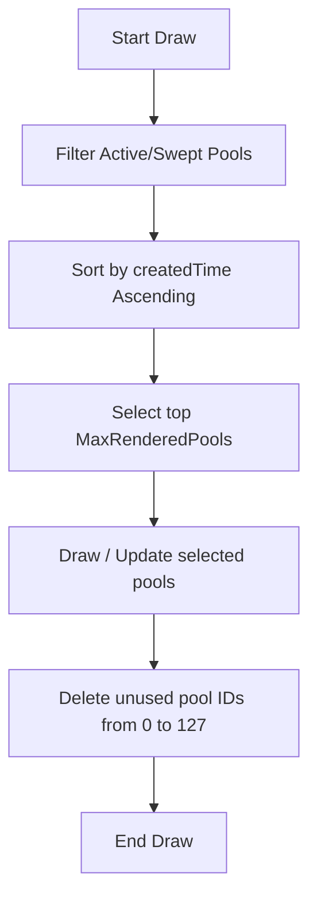

# Module 013 Stage 3: Liquidity Pool Renderers Design

This document describes the design specifications, object naming convention, pipeline execution, and lifecycle-to-visual mapping for rendering BSL, SSL, EQH, and EQL liquidity pools on MetaTrader 5 charts.

---

## 1. Object Naming Convention

To prevent object name collisions, leaks, and visual glitches, the renderer follows the MNS prefix convention. Each object name incorporates the pool ID directly:

| Pool Category | Source Engine Condition | Object Type | Name Structure | Example | Description |
|---|---|---|---|---|---|
| **Buy-Side (BSL)** | `type == LIQUIDITY_BSL` && `source != LIQ_SRC_EQ` | `OBJ_TREND` | `MNS_LiqBSL_[id]` | `MNS_LiqBSL_42` | BSL line at level |
| **Sell-Side (SSL)** | `type == LIQUIDITY_SSL` && `source != LIQ_SRC_EQ` | `OBJ_TREND` | `MNS_LiqSSL_[id]` | `MNS_LiqSSL_17` | SSL line at level |
| **Equal Highs (EQH)** | `type == LIQUIDITY_BSL` && `source == LIQ_SRC_EQ` | `OBJ_TREND` | `MNS_LiqEQH_[id]` | `MNS_LiqEQH_88` | Equal high dotted line |
| **Equal Lows (EQL)** | `type == LIQUIDITY_SSL` && `source == LIQ_SRC_EQ` | `OBJ_TREND` | `MNS_LiqEQL_[id]` | `MNS_LiqEQL_91` | Equal low dotted line |

---

## 2. Rendering Pipeline

The rendering execution flow runs inside `CLiquidityRenderer::Draw` on each update cycle:



1. **Filtering**: Extract all pools from `CLiquidityEngine` that are active (`active == true` or `lifecycle == LIQ_ACTIVE || lifecycle == LIQ_TOUCHED`) or swept (`lifecycle == LIQ_SWEPT || swept == true`). Equal pivots (EQH/EQL) are filtered out if not active.
2. **Sorting**: Sort the renderable list by `createdTime` ascending (oldest first), with `id` as a tie-breaker.
3. **Capping**: When the count exceeds `MaxRenderedPools`, discard the oldest elements (front of the sorted list).
4. **Drawing**:
   - For **active** pools, draw a horizontal line segment from `createdTime` to `time[1]` (the last confirmed bar).
   - For **swept** pools, draw a horizontal line segment from `createdTime` to `sweptTime`.
5. **Garbage Collection**: Construct names for all potential pool IDs (`0..127`) that were *not* rendered this turn, and delete their objects if they exist.

---

## 3. Lifecycle → Visual State Mapping

Visual attributes are mapped dynamically from `SIndicatorStyle` and `SLiquidityPool` properties:

```
                  ┌──────────────────────┐
                  │   SLiquidityPool     │
                  └──────────┬───────────┘
                             │
            ┌────────────────┴────────────────┐
            ▼                                 ▼
   [lifecycle == LIQ_SWEPT]           [active == true]
            │                                 │
     (Swept Styling)                  (Active Styling)
  - styleLiqSwept (STYLE_DOT)       - styleLiqActive (STYLE_DASH)
  - colorSweptPool (clrSlateGray)   - colorBSL/colorSSL/colorEQH/colorEQL
  - Terminate at sweptTime          - Terminate at time[1]
```

- **Width Scaling by Priority (Inferred)**:
  - `PRIORITY_LOW` $\rightarrow$ `widthLiqLine` (default: 1)
  - `PRIORITY_MEDIUM` $\rightarrow$ `widthLiqLine + 1` (default: 2)
  - `PRIORITY_HIGH` $\rightarrow$ `widthLiqLine + 2` (default: 3)
