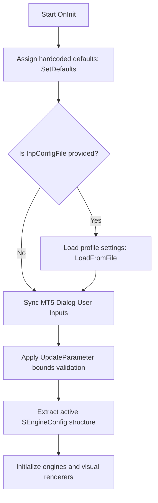

# MNS Trading Engine — Module 013
# Stage 6: Configuration Binding Design Document

## 1. Overview
This document specifies the architectural design for the integration of **INF-004 Configuration Engine** into the **Module 013 Indicator Integration**. 

Historically, user-facing indicator inputs and profiles were isolated in MT5 inputs, causing configuration drifts between the Expert Advisor (EA) and the visual indicators. Stage 6 unifies all settings by routing them through the centralized `CMNSConfig` system, ensuring a single source of truth for both analytical calculation boundaries and graphical layout specifications.

---

## 2. Configuration Bindings Layout

All configuration options are stored within the centralized `SEngineConfig` structure inside [Include/MNS/MNSConfig.mqh](file:///c:/Users/CarixStudio/AppData/Roaming/MetaQuotes/Terminal/D0E8209F77C8CF37AD8BF550E51FF075/MQL5/mns-engine/Include/MNS/MNSConfig.mqh). The new parameters are grouped as follows:

```mql5
struct SEngineConfig
{
    //--- Existing Strategy Fields (Strategy Invariants)
    int    externalDepth;
    int    internalDepth;
    double atrTolerance;
    double minBreakDistance;
    double confidenceThreshold;
    double displacementMinAtrMultiple;
    double displacementMinBodyRatio;
    double displacementMinCloseStrength;
    int    atrPeriod;
    bool   logEnable;
    int    logLevel;

    //--- Analytical Settings (M13-ISSUE-002, M13-ISSUE-004)
    int    gmtOffset;                 // GMT Offset in hours
    double maxSpreadPoints;           // Max spread filter
    double desiredRiskPercent;         // Desired risk percent per trade

    //--- Visual Capping Settings (M13-ISSUE-006)
    int    maxRenderedSwings;         // Max swing objects to render
    int    maxRenderedBreaks;         // Max BOS/CHoCH lines to render
    int    maxRenderedPools;          // Max liquidity pool lines to render
    int    maxRenderedPOIs;           // Max POI rectangles to render

    //--- Dashboard Layout Settings
    bool   showDashboard;             // Enable dashboard rendering
    int    dashboardX;                // X-coordinate dashboard pixel offset
    int    dashboardY;                // Y-coordinate dashboard pixel offset
    int    dashboardWidth;            // Panel width in pixels
};
```

---

## 3. Dynamic Bounds & Range Validation

All parameters updated via `CMNSConfig::UpdateParameter()` must pass strict bounds checks. If a value falls outside the predefined range, an assertion fails and the update is rejected (returning `false`), preventing memory corruption or unstable layouts:

| Parameter Name | Target Data Type | Allowed Range | Default Value | Assert Action |
| :--- | :--- | :--- | :--- | :--- |
| `gmtOffset` | `int` | `[-12 .. 12]` | `0` | Fail on range violation |
| `maxSpreadPoints` | `double` | `[0.0 .. 500.0]` | `50.0` | Fail on range violation |
| `desiredRiskPercent` | `double` | `[0.0 .. 10.0]` | `1.0` | Fail on range violation |
| `maxRenderedSwings` | `int` | `[10 .. 500]` | `50` | Fail on range violation |
| `maxRenderedBreaks` | `int` | `[5 .. 200]` | `20` | Fail on range violation |
| `maxRenderedPools` | `int` | `[5 .. 200]` | `20` | Fail on range violation |
| `maxRenderedPOIs` | `int` | `[5 .. 200]` | `20` | Fail on range violation |
| `showDashboard` | `bool` | `Any double` | `true` | Boolean assignment (val != 0.0) |
| `dashboardX` | `int` | `[0 .. 2000]` | `20` | Fail on range violation |
| `dashboardY` | `int` | `[0 .. 2000]` | `20` | Fail on range violation |
| `dashboardWidth` | `int` | `[150 .. 500]` | `250` | Fail on range violation |

---

## 4. Settings Profile Loading Flow

When the indicator starts inside `OnInit()`, configuration settings are loaded and merged in a hierarchical order to support external profile files while maintaining MT5 user-input overrides:



This flow ensures that:
1. `SetDefaults()` sets strategy invariants.
2. Custom configuration `.ini` files (sandboxed inside `MQL5\Files`) overwrite strategy defaults.
3. The MT5 User Settings dialog overrides the custom `.ini` files, enabling live adjustments on the chart.

---

## 5. Engine & Renderer Initialization Mappings

Once the active configuration structure `cfg` is extracted via `CMNSConfig::GetActive()`, settings are mapped to the core components during their initialization routines:

| Component | Target Method | Bound Config Fields |
| :--- | :--- | :--- |
| `CSwingDetector` | `Initialize()` | `cfg.externalDepth`, `cfg.internalDepth` |
| `CLiquidityEngine` | `Initialize()` | `cfg.gmtOffset` |
| `CEntryEngine` | `Initialize()` | `cfg.maxSpreadPoints` |
| `CRiskEngine` | `Initialize()` | `cfg.desiredRiskPercent` |
| `CSwingRenderer` | `Initialize()` | `cfg.maxRenderedSwings` |
| `CStructureRenderer` | `Initialize()` | `cfg.maxRenderedBreaks` |
| `CLiquidityRenderer` | `Initialize()` | `cfg.maxRenderedPools` |
| `CPOIRenderer` | `Initialize()` | `cfg.maxRenderedPOIs` |
| `CDashboardRenderer` | `Initialize()` | `cfg.showDashboard`, `cfg.dashboardX`, `cfg.dashboardY`, `cfg.dashboardWidth` |

Inside `OnCalculate()`, `CDashboardRenderer::Draw()` reads the dynamic `cfg.dashboardX`, `cfg.dashboardY`, and `cfg.dashboardWidth` variables from `CMNSConfig` to correctly position, size, and scale the status dashboard.
